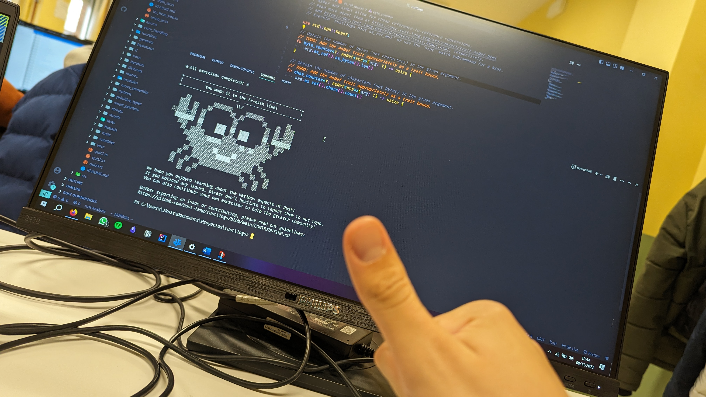

# Rustlings solutions
These are my solutions to the rustlings exercises.  
These are probably *not* the best solutions for the exercises but they work, 
for some of them I really needed help, but, hey, it's finished: 

For reference purposes, I have finished them on 11/08/2023 (English speaking countries) or 08/11/2023 (Spanish speaking countries)
## Suggestions, changes, etc.
Any doubt, suggestion or change you want to make or ask me something, open an issue or a PR, I will try to answer them

## Order of exercises and Rust book reference
| Exercise               | Book Chapter        |
| ---------------------- | ------------------- |
| variables              | §3.1                |
| functions              | §3.3                |
| if                     | §3.5                |
| primitive_types        | §3.2, §4.3          |
| vecs                   | §8.1                |
| move_semantics         | §4.1-2              |
| structs                | §5.1, §5.3          |
| enums                  | §6, §18.3           |
| strings                | §8.2                |
| modules                | §7                  |
| hashmaps               | §8.3                |
| options                | §10.1               |
| error_handling         | §9                  |
| generics               | §10                 |
| traits                 | §10.2               |
| tests                  | §11.1               |
| lifetimes              | §10.3               |
| iterators              | §13.2-4             |
| threads                | §16.1-3             |
| smart_pointers         | §15, §16.3          |
| macros                 | §19.6               |
| clippy                 | §21.4               |
| conversions            | n/a                 |
